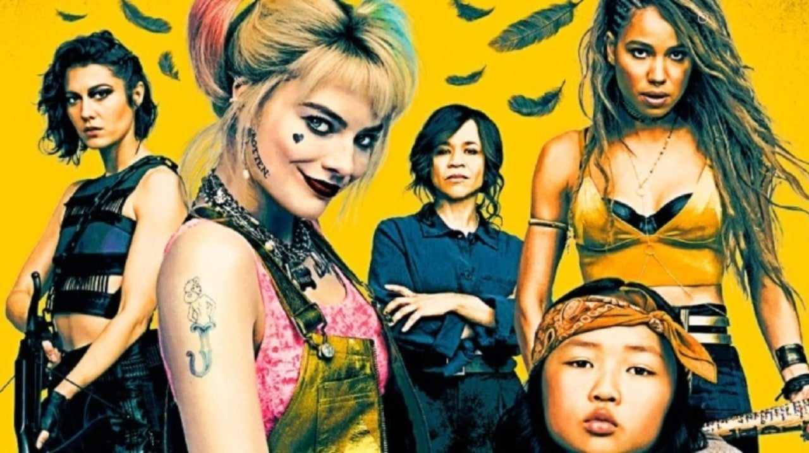

import Header from "../../components/blog_post_header.js";

<Header {...props.pageContext.frontmatter} />

<h1>{props.pageContext.frontmatter.title}</h1>

Can we just let women direct all of these superhero movies, this neverending deluge of superhero movies, forevermore? And let them write and produce them? _Birds of Prey and the Fantabulous Emancipation of One Harley Quinn_ (I honestly still can't believe that's the actual title) was so different &mdash; in both tone and intent &mdash; from what it would have been had it been handled by virtually any male director and/or screenwriter. We have ample suggestion for how a movie like that would have looked by considering _Suicide Squad_, the movie that introduced Margot Robbie's Harley Quinn as an explosively shallow concoction of booty shorts and violent insanity.

But Robbie recognized there could be far more to the character, and she pushed to get _Birds of Prey_ made with women behind the helm, and creatively speaking, her instincts paid off. Harley had more depth in the trailers for this movie than she did in that whole film. (Sadly, it seems that the gamble didn't pay off quite so well at the box office, where it's initial weekend has proven to be infuriatingly disappointing.)

_(**Mild-ish spoilers ahead.** Proceed at your own risk if you haven't seen the movie yet.)_

## Emancipation Proclamations

_Birds/Harley_ is ultimately a movie about freedom, about shaking off a weight that's been holding you back for so long that you can't even remember what life was like before the weight. And it's about the choices you make to get you to that point, and then what happens after &mdash; when you have your freedom, what then? What kind of person do you become when the shackles have been broken?

Every one of the five leading ladies in _BoP_ must overcome some form of drag against her better self, whether it's an incredibly, murderously toxic former relationship or an unwanted familial birthright or a system that makes doing the right thing difficult or even impossible. Harley herself provides the most obvious, foregrounded example, the "fantabulous emancipation" of the title: she has to get out from under the Joker and everything he represents to her _and_ to everyone else in the movie. She's only ever been the Joker's dame -- even her very name is a nod to her status as the Clown Prince of Crime's sidekick.

(I cannot even begin to tell you how happy I am that the Joker himself, now one of my absolutely least-favorite characters across all media, didn't appear at all in the movie.)

Robbie and the women behind the camera (director Cathy Yan and screenwriter Christina Hodson) try to show that Harley's not evil, but she's most definitely _broken_. Is there an implication that she was broken in some way even before her relationship with Mr. J? Was there already a fracture in her soul that the Joker was able to exploit, or was he responsible for the whole break? Hard to say for sure, and this movie doesn't really indicate one way or the other -- though one can imagine that if an accomplished psychiatrist willingly threw her life away and herself into a vat of chemicals for a notorious murderer, she _probably_ had some issues to begin with.

But in the end, that's not the point - _Birds/Harley_ is much more interested in where Harley is as the story starts and where she's going than where she's been. The movie also doesn't try to point Harley entirely toward the straight-and-narrow by the end, either &mdash; at best, she's chaotic neutral, most interested in doing for herself. (That's still a step up from where she is at the movie's beginning.)

I appreciated that the movie wanted the audience to identify strongly with Harley Quinn, and adjusted her behavior accordingly, giving her the standard anti-hero treatment: sure, she killed a few mostly-nameless goons, but all of the people she offed undoubtedly _deserved_ it. She didn't kill anyone we should have assumed to be redeemable, and she didn't kill any cops &mdash; she _hurt_ plenty, but didn't kill any. Her behavior in this movie moved her away from "supervillain" status and put her more in the Deadpool/Wolverine camp. Harley's far from the first lead in a superhero movie to murder only really rotten people; how many Nazis did Captain America kill in World War 2, after all?

## The Birds

I loved Dinah "Black Canary" Lance (Jurnee Smollett-Bell) &mdash; and really _really_ loved that Smollett-Bell did her own singing, what a voice! &mdash; and wished we'd gotten more of her character. But this was undoubtedly Harley's movie. Dinah struggles over and over with her natural impulse toward do-goodery against a weary fatalism, a none-of-it-matters-so-keep-your-head-down attitude. The script alludes to her mother, a superhero who operated in Gotham and died an ugly, early death &mdash; Dinah doesn't want to end up like her mother, so she keeps her powers bottled up and she tries not to get herself involved. She sees terrible things happening &mdash; to Harley, to Cass, to a random woman in Roman Sironis' club &mdash; and that impulse collides head-on with that practiced apathy. For Dinah, the weight to be discarded was the _fear_ &mdash; not fear of action or of pain, necessarily, but of commitment.

Helena "Huntress" Bertinelli (Mary Elizabeth Winstead) devoted herself so much to revenge on the men who murdered her family that she developed absolutely no social skills whatsoever. I'm glad Winstead was able to play that off as a lovable dorkiness; had she played it as it probably _should_ have been, I don't think it would have fit the tone of the movie. She got the least screen time of all of the five lead women, and I'd like to see more of her in the sequel that I sincerely hope is coming &mdash; I don't need to see any more of her past than we've already gotten, I want to see more of Helena working to become a full person now that her revenge business is done. (She'd have made a wonderful Dread Pirate Roberts.)

Renee Montoya (Rosie Perez), whom we're repeatedly told is a refugee from 80s cop movies, followed a familiar path: she wanted to do The Right Thing&trade;, to take down bad guys and protect innocents &mdash; even when her job as a detective got in her way. Instead of using her badge as a cover for performing horrible acts (y'know, like what happens so often in real life), she escaped from underneath her badge so she could pursue justice.

## Big Queer Energy

I realize that I'm filtering this movie through my own queer-centric tastes, of course, but it felt to me that _Birds of Prey_ was positively _swimming_ with Big Queer Energy, even though there were _no_ romantic or sexual storylines at play. For a movie with almost nothing overtly alluding to its characters' sexualities or identities, _Birds of Prey_ was queer as hell.

Did I read it as queer just because it was so woman-focused, because the only men in the movie were all awful (and, honestly, two of them had plenty of their own Big Queer Energy between them)?

Am I _so desperate for representation_ that I read a movie that's on its face about burgeoning friendships and bonds between women as queer simply because it doesn't have men's sexual desires slathered all over it?

If so, then so. I don't care. I'm still shipping Harley and Helena pretty hard. (And let's be honest, I'm pretty sure Harley was shipping it, too.)

I loved the nods to Montoya's canonical queerness (and her ex was another woman of color (Ali Wong), no less!) &mdash; it's been one of her defining characteristics for most of her existence, so I was grateful for it at least to have been mentioned. Her sexuality wasn't a huge part of _this movie's story_ but it's an important part of _her_ story.

(I admit I'm a little angry that it feels the filmmakers could only allude to Montoya as a lesbian, even in that cursory manner, because of the movie's R rating &mdash; we're still not all that comfortable mixing our queer characters with our superhero blockbusters.)

There was almost nothing for the male gaze in this movie; even the scene where Sironis (Ewan McGregor, having _far_ too much fun) made a woman get on a table and strip as punishment for a perceived offense, we saw _nothing_. The emotional meaning of the scene came through clearly &mdash; for Roman, for the woman, for Dinah &mdash; without needing to see the woman's nakedness. Just imagine how a similar scene would have played out under the hands of most male directors. I mean, just think about a Zac Snyder take on that scene. The thought makes me shudder.

_(Originally published on [Medium](https://medium.com/@allison_holt/review-birds-of-prey-and-the-fantabulous-emancipation-of-one-harley-quinn-d85c401bf29b).)_
